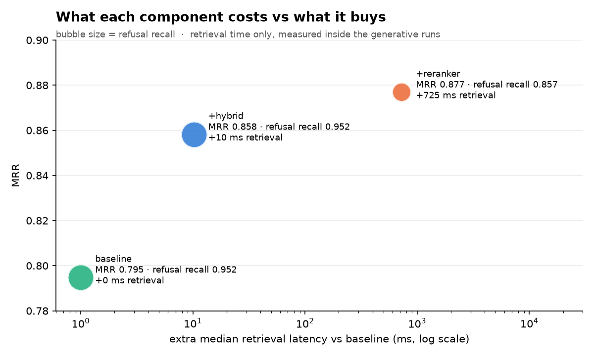
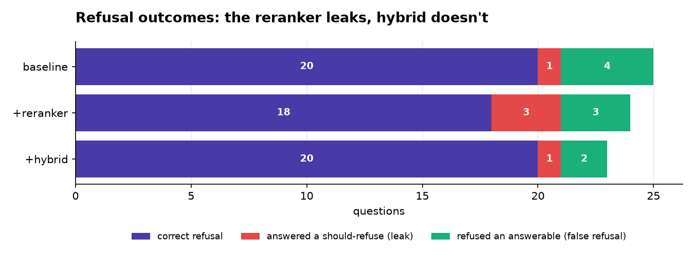
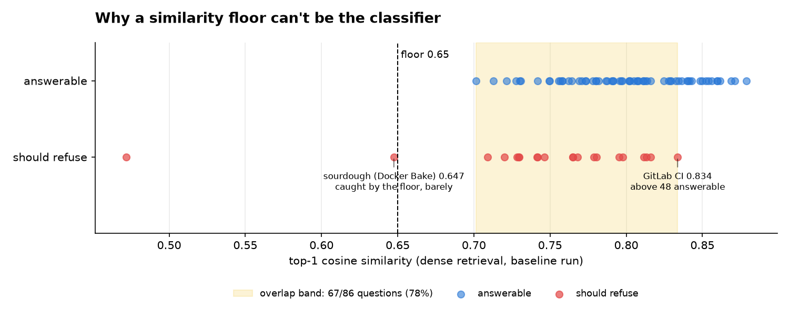

# InfraChat

**Ask the Kubernetes and Docker docs a question — get an answer with citations, or an honest
"I don't know."**

A retrieval-augmented QA system over the [Kubernetes](https://github.com/kubernetes/website) and
[Docker](https://github.com/docker/docs) documentation, built as a **baseline plus one retrieval
component at a time** — reranker, hybrid search, query rewriter — with every addition measured
against the same eval set.

Two rules the whole system is built around: **an answer without a citation is a bug**, and
**every component must earn its place with a number.**

## Results

87 fixed questions (33 Kubernetes, 33 Docker, **21 built to be refused**) over 4,908 chunks.
Each row adds one component to the baseline; the runs are paired on the 86 questions that
completed in all three.

| | MRR | hit@5 | refusal recall | false refusals | citation validity | added retrieval latency |
|---|---|---|---|---|---|---|
| baseline (dense) | 0.795 | 0.969 | **0.952** | 6.2% | 1.000 | — |
| + reranker | **0.877** | 0.985 | 0.857 | 4.6% | 1.000 | +821 ms |
| **+ hybrid (shipped)** | 0.858 | 0.969 | **0.952** | **3.1%** | 1.000 | **+6 ms** |
| + query rewriter | ≈ +1 question for one extra LLM call per query — **not shipped** ([ADR-0010](docs/decisions/0010-query-rewriter-steers-retrieval-and-does-not-ship.md)) |||||

Latency is from the retrieval-only runs, measured back to back on the same machine; the
end-to-end runs share Groq with other traffic, so their totals aren't comparable.

**The reranker ranked best and made the system less honest.** It lifted MRR by 0.08, but on 2
questions that should have been refused (and that the baseline did refuse) it found the most
plausible *wrong* chunk, and the model answered from it, with valid citations. Hybrid search
(BM25 + dense, rank fusion) got 71% of the gain at 0.8% of the latency with no loss of refusal recall, so it ships
([ADR-0011](docs/decisions/0011-hybrid-is-the-default-retriever.md)).

**No similarity threshold can separate answerable from unanswerable questions.** 78% of them sit in
the overlap band, and one trap (GitLab CI, 0.834) outscores 48 of 66 answerable questions. The
floor is a cheap first filter; the citation check does the real work (22 of 24 baseline refusals).

**Where it stops.** The citation check proves *provenance* (the cited chunk was shown to the
model), not *entailment* (the chunk supports the claim) —
[ADR-0007](docs/decisions/0007-citation-check-verifies-provenance-not-entailment.md). The
reranker's fabrications passed it, which makes an entailment check the next thing to build.
87 author-written questions is a small set: one question moves a rate by about 1.1 points.

All 8 charts: [`docs/images/results/`](docs/images/results/) · regenerate with
`python scripts/plot_results.py` · raw runs in [`eval/runs/`](eval/runs/) · the terms explained in
[docs/CHEATSHEET.md](docs/CHEATSHEET.md).

## Docs

| | Doc |
|---|---|
| **What** must be true | [docs/SPEC.md](docs/SPEC.md) |
| **How** it's shaped | [docs/ARCHITECTURE.md](docs/ARCHITECTURE.md) |
| **In what order** | [docs/ROADMAP.md](docs/ROADMAP.md) |
| **How it's measured** | [docs/EVAL.md](docs/EVAL.md) |
| **Why** (the ADR trail) | [docs/decisions/](docs/decisions/) |
| **Diagrams** | [docs/ARCHITECTURE.md](docs/ARCHITECTURE.md#how-the-system-grows) — baseline through final |

**Start here → [docs/README.md](docs/README.md)** · Status: **Phases 1–4 built and measured** — hybrid retrieval ships: MRR 0.795 → 0.858 with no loss of refusal recall ([ROADMAP](docs/ROADMAP.md#current-status))
    