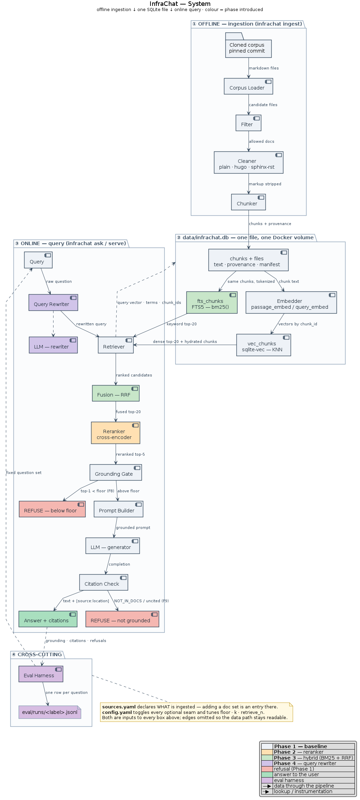
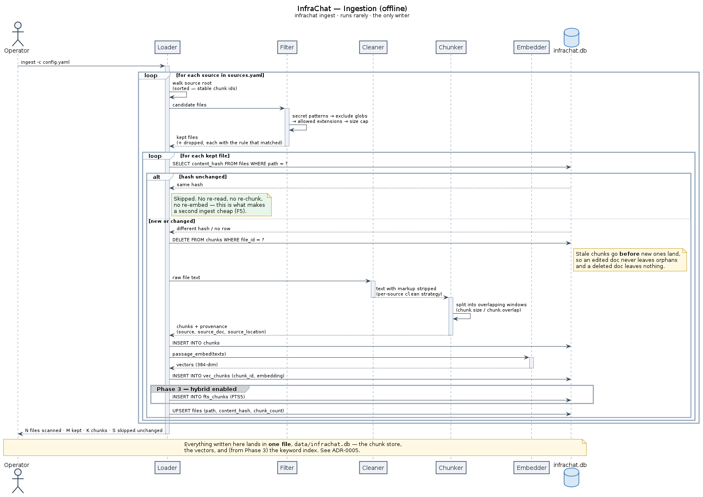
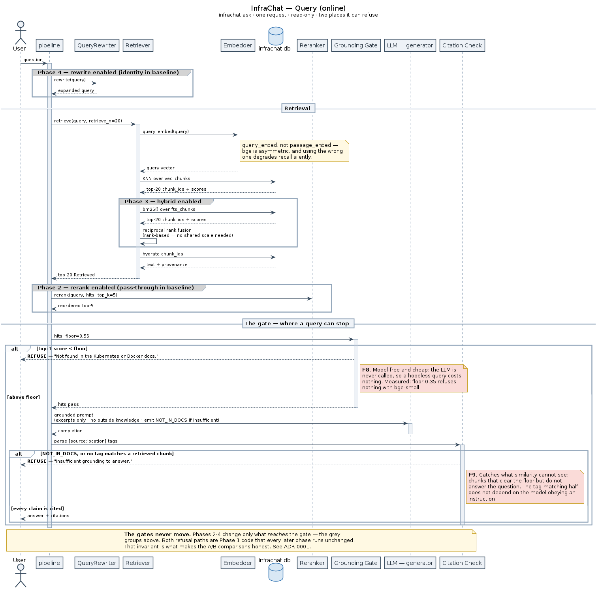

# InfraChat — Architecture

> *How* the system is shaped and why the pieces sit where they do. The fixed contracts are in
> [SPEC.md](SPEC.md); the reasoning behind each choice is in [decisions/](decisions/); *in what
> order* it gets built is in [ROADMAP.md](ROADMAP.md); how it's scored is in [EVAL.md](EVAL.md).
>
> Every diagram on this page has a PlantUML source in [diagrams/](diagrams/) and a rendered PNG in
> [images/](images/). **If you change one, re-render and commit both.**

## The whole system

[](images/system.png)

*Source: [`diagrams/system.puml`](diagrams/system.puml) — component colour marks the phase that
introduced it. This diagram shows **shape**; the two sequence diagrams below show **order**.*

## What it looks like

**Answerable (Kubernetes):**
```
Q: What is a Pod?
A: A Pod is the smallest deployable unit in Kubernetes, a group of one or more
   containers with shared storage and network. [kubernetes:concepts/workloads/pods]
```

**Answerable (Docker):**
```
Q: How does a multi-stage build work?
A: A multi-stage build uses multiple FROM statements so build artifacts can be
   copied into a smaller final image, keeping it lean. [docker:manuals/build/multi-stage]
```

**Refusal — gate 1, retrieval floor (F8):**
```
Q: Who won the 2022 World Cup?
A: Not found in the Kubernetes or Docker docs.        (top-1 similarity 0.499 < floor)
```

**Refusal — gate 2, citation check (F9):**
```
Q: How do I bake sourdough bread?
A: Insufficient grounding to answer.
```
Measured: that question scores **0.652** and clears the floor, because Docker has a build
tool called **Bake**. The chunk genuinely is similar, so no threshold catches it — only
the model reading the excerpts does. Five of the six `should-refuse` questions in the eval
set behave this way, which is the empirical case for two independent gates
([ADR-0001](decisions/0001-refuse-over-fabricate.md)).

The refusal is the demo. Anyone can show a RAG system answering; showing one decline cleanly is
the part that's actually hard.

## Two paths, one corpus

InfraChat is two pipelines that meet at the stores:

| | **OFFLINE — ingestion** | **ONLINE — query** |
|---|---|---|
| Trigger | `infrachat ingest`, run rarely | one user question, `infrachat ask` / `serve` |
| Shape | batch, whole corpus | single request, latency-sensitive |
| Writes | Chunk Store, Vector Store, Keyword Index | nothing — read-only |
| Cost driver | embedding the corpus once | LLM calls per query |
| Fails how | loudly, rerun it | **quietly refusing** rather than guessing |

They share exactly two things, and both are drawn as dashed lines crossing the package boundary
rather than duplicated components:

- **The `Embedder` seam.** The same model that embedded the chunks must embed the query, or the
  vectors aren't comparable.
- **The `Chunk Store`.** Vector search returns `chunk_id` + score; the online path hydrates text
  and provenance from the same store the offline path wrote. Chunk text exists in exactly one
  place ([ADR-0005](decisions/0005-one-sqlite-file.md)).

## Ingestion, in order

[](images/ingest-sequence.png)

*Source: [`diagrams/ingest-sequence.puml`](diagrams/ingest-sequence.puml). The chain is
unsurprising; the **manifest branch** is the part worth reading — an unchanged file is skipped
without being re-read, and a changed one has its old chunks deleted **before** new ones land, so
an edited document never leaves orphans.*

## Component catalogue

Every component in the diagrams, what it does, and the SPEC contract it implements. **Component
names here match the diagrams exactly.**

### Offline — ingestion

| Component | Does | Contract | Phase |
|---|---|---|---|
| **Cloned corpus** | Two markdown trees on disk, at a pinned commit | [Corpus](SPEC.md#corpus--what-documents-from-where) | 1 |
| **Corpus Loader** | Walks the trees, yields candidate files | F1 | 1 |
| **Filter** | Drops secrets, binaries, oversized files — *before* embedding | F2 | 1 |
| **Chunker** | Splits into overlapping chunks, strips frontmatter, attaches provenance | F3 · `Chunk` | 1 |
| **Chunk Store** «seam» | Chunk text + provenance and the file manifest — **the single source of truth** (`chunks`, `files`) | F5 · `ChunkStore` | 1 |
| **Cleaner** «seam» | Strips a source's markup before chunking — the per-source format seam | [ADR-0006](decisions/0006-pluggable-sources.md) | 1 |
| **Embedder** «seam» | Chunk text → vectors (local CPU model by default) | F4 · `Embedder` | 1 |
| **Vector Store** «seam» | Vectors keyed by `chunk_id` (`vec_chunks`, sqlite-vec — same file) | F5 · `VectorStore` | 1 |
| **Keyword Index (BM25)** «seam» | The *same* chunks tokenized (`fts_chunks`, FTS5 — same file), real `bm25()` | F13 · `KeywordIndex` | 3 |

### Online — query

| Component | Does | Contract | Phase |
|---|---|---|---|
| **Query** | The user's raw question | — | 1 |
| **Query Rewriter** «seam» | Rewrites/expands the question before retrieval | F14 · `QueryRewriter` | 4 |
| **LLM — rewriter** «seam» | The small/cheap model behind the rewriter | `LLMClient` | 4 |
| **Dense Retriever** «seam» | Embeds the query, pulls `retrieve_n` candidate ids, hydrates them from the chunk store | F6 · `Retriever` | 1 |
| **Fusion (RRF)** | Merges the dense and keyword ranked lists by rank | F13 · `Fusion` | 3 |
| **Reranker** «seam» | Cross-encoder re-scores candidates jointly, keeps top `k` | F12 · `Reranker` | 2 |
| **Grounding Gate** | Refuses when top-1 score < `floor` | **F8** | 1 |
| **Prompt Builder** | Renders retrieved excerpts into the grounded prompt | `build_grounded_prompt` | 1 |
| **LLM — generator** «seam» | Answers *from the excerpts only* | F7 · `LLMClient` | 1 |
| **Citation Check** | Rejects `NOT_IN_DOCS` and uncited answers | **F9** · `parse_answer` | 1 |
| **Answer + citations** | The rendered answer, citations naming doc set + location | F10 | 1 |
| **REFUSE (below floor)** | *"Not found in the Kubernetes or Docker docs."* | F8 | 1 |
| **REFUSE (not grounded)** | *"Insufficient grounding to answer."* | F9 | 1 |

### Cross-cutting

| Component | Does | Contract | Phase |
|---|---|---|---|
| **Eval Harness** | Drives the fixed question set through the pipeline, scores the run | F11 · [EVAL.md](EVAL.md) | 1 |
| **config.yaml** | Toggles every optional seam — *the config is the experiment* | F15 | 1 |

## The grounding gate (the centrepiece)

Everything else in this document is plumbing around **two refusal paths**. They are independent,
they trip at different stages, and either one is enough to withhold an answer:

```
                    ┌── top-1 score < floor ──────────────▶ REFUSE (below floor)      ← F8
retrieved hits ─────┤
                    └── above floor ──▶ LLM ──▶ citation check
                                                    │
                                                    ├── "NOT_IN_DOCS" ────────────────▶ REFUSE (not grounded)
                                                    ├── no matchable [source:location] ▶ REFUSE (not grounded)   ← F9
                                                    └── cited ────────────────────────▶ Answer + citations
```

- **Refusal 1 — retrieval-side (F8).** Cheap and model-independent: if the best chunk isn't
  similar enough, the LLM is never called. This one also saves money.
- **Refusal 2 — generation-side (F9).** The model is *instructed* to emit `NOT_IN_DOCS` when the
  excerpts don't answer the question, and an answer whose citation tags don't match back to real
  retrieved chunks is rejected too. Retrieval can return plausible-but-irrelevant chunks that
  clear the floor; this is the gate that catches it.

**Neither gate ever moves.** Phases 2–4 change *what reaches* the gate — never the gate itself.
That invariant is what makes the A/B comparisons in [EVAL.md](EVAL.md) honest, and it's why the
gate is the same Phase 1 code in all five diagrams.
See [ADR-0001](decisions/0001-refuse-over-fabricate.md).

## How the system grows

Each phase adds **exactly one component** and re-runs the same eval. Rather than one diagram per
phase, the two sequence diagrams show every phase at once — later-phase components appear as grey
`group` blocks, so you can see that **everything Phases 2–4 add sits before the gate**:

[](images/query-sequence.png)

*The online path. Grey groups are later phases; the two `alt` branches are the refusals. Source:
[`diagrams/query-sequence.puml`](diagrams/query-sequence.puml).*

### Phase 1 — Baseline RAG

The whole pipeline at its simplest: dense retrieval straight into the gate. Both refusal paths
and the **eval harness** exist from day one — the harness is the spine, not an afterthought
([ADR-0003](decisions/0003-eval-harness-is-phase-1.md)).

The unused seams are already wired as **null objects**: identity `QueryRewriter`, dense-only
`Retriever`, pass-through `Reranker`. Later phases swap an implementation; they never rewire the
pipeline ([ADR-0002](decisions/0002-null-object-seams.md)).

### Phase 2 — + Cross-encoder Reranker

**What changed:** one component between `Dense Retriever` and `Grounding Gate`, and `retrieve_n`
goes from 5 to 20.

**Why:** the dense retriever embeds query and chunk *separately*, so it is fast but blunt. A
cross-encoder scores the pair **jointly** — much more accurate, and far too slow to run over the
whole corpus. Hence the two-stage shape: **recall 20 cheaply, then re-order precisely, keep 5**
(an ADR lands with the Phase 2 numbers).

**What it costs:** reranking latency on every query, and a second model to host.

### Phase 3 — + Hybrid Search (BM25 + RRF)

**What changed:** the ingestion path writes the same chunks to a **second index** (BM25, no
embedding step), and a **Fusion** step merges two ranked lists before reranking. The `Retriever`
seam is unchanged — only its implementation is.

**Why:** dense embeddings match *meaning* and miss *literals* — `--mount=type=cache`,
`CrashLoopBackOff`, `ImagePullBackOff`. BM25 does the opposite. Infrastructure docs are full of
exact tokens, so this is the phase where the corpus itself argues for hybrid.
**RRF fuses by rank, not by score**, so the two arms never need a shared scale
(an ADR lands with the Phase 3 numbers).

**What it costs:** a second index to build. Note what it *doesn't* cost: both indexes are derived
from the chunk store, so they cannot drift, and either can be rebuilt without re-walking the
corpus. That's the payoff for [ADR-0005](decisions/0005-one-sqlite-file.md) landing before
this phase rather than after it.

### Phase 4 — + Query Rewriter

**What changed:** a small LLM sits in front of retrieval and rewrites the question
(*"how do I make my image smaller?"* → *"multi-stage build, reduce image size, COPY --from"*).
Both retrieval arms see the rewritten query.

**Why:** users don't phrase questions the way docs phrase answers. Note this introduces a
**second LLM role** — rewriter and generator both sit behind `LLMClient` but are configured
independently, so the rewriter can run a much cheaper model ([SPEC § LLM calling](SPEC.md#llm-calling)).

**What it costs:** an extra LLM call — **latency and tokens on every single query**. This is the
one addition most likely to fail to earn its place, and the eval measures the added latency
alongside the quality delta so that verdict is a number.

## Why any of this is swappable

The pipeline depends only on the interfaces in
[SPEC.md § The seams](SPEC.md#the-seams-pluggable-interfaces), never on an implementation. Three
properties fall out of that, and they're the reason the phased plan works at all:

1. **Adding a component is a config change**, not a refactor.
2. **Baseline and enhanced run the same code path**, so an A/B changes exactly one variable.
3. **Implementations are replaceable** — SQLite → Postgres/pgvector, local embeddings → an API, a hosted
   LLM → a local Ollama model.

See [ADR-0002](decisions/0002-null-object-seams.md).

## Storage & packaging

**One file, three roles** — full schema in [SPEC § Storage](SPEC.md#storage):

```
data/                     ← one Docker volume
└── infrachat.db          ← chunks + files manifest    (relational)
                             vec_chunks                (sqlite-vec — vectors by chunk_id)
                             fts_chunks                (FTS5 bm25() — Phase 3)
```

The vector table and keyword index are **derived artifacts** of the `chunks` table. Drop either
and it rebuilds from the same file without touching the corpus; delete the volume and a full
`ingest` rebuilds everything from the pinned clone.

Because all three share one connection, a vector search can `JOIN` relational columns in a single
query — per-source filtering and provenance hydration are SQL, not Python glue
([ADR-0005](decisions/0005-one-sqlite-file.md)).

| Target | Data | Ingest runs there? |
|---|---|---|
| Local / home-lab | `./data` mounted as a volume | yes — this is where indexes are built |
| Public demo (hosted Spaces) | index **baked read-only into the image** | **no** — free-tier filesystems are ephemeral, so a volume wouldn't survive a restart |

**Phase 5 may swap the backend, not the design.** Migrating the chunk store and vectors to
Postgres + pgvector is a deployment variant, taken *after* Phase 1–4 measurements are locked so
network latency never lands inside the numbers. `chunk_store:` and `store:` exist to make that a
swap rather than a rewrite ([ADR-0005](decisions/0005-one-sqlite-file.md)).

## Assumptions & risks (on the record)

- **The corpus is a pinned snapshot.** No live fetching in v1 — eval runs are only comparable if
  the corpus doesn't move under them ([SPEC § Corpus](SPEC.md#corpus--what-documents-from-where)).
  Cost: answers go stale as upstream docs change.
- **Retrieval quality is bounded by chunking.** Chunk size and overlap are set once and held
  fixed across all phases; a bad chunking decision quietly caps every later component's ceiling.
  If a phase shows no delta, chunking is the first suspect.
- **The similarity floor is a tuned constant**, not a calibrated probability. Scores are not
  comparable across embedders — **change the embedder and the floor must be re-tuned.**
- **Rerank/fusion scores are not on the same scale as raw similarity.** The gate reads
  `hits[0].score`, so whatever populates that field defines what `floor` means. This is the
  sharpest edge in the whole design: it is the one place where adding a component *can* silently
  change gate behaviour, and it must be re-checked whenever a stage that rewrites scores is enabled.
- **`sqlite-vec` is pre-1.0 (0.1.9).** The API may shift under us. Accepted knowingly: the
  `VectorStore` seam means swapping back to a dedicated vector database is one file.
- **SQLite is a single-writer store.** Irrelevant as designed — ingestion is one batch process
  and the query path is read-only — but it's the constraint that bites first if ingestion is ever
  parallelised.
- **One generator call per query.** No agentic multi-hop — cost and latency stay flat and
  predictable, at the cost of questions that genuinely need two retrieval hops.
- **Single-user, no auth, no rate limiting.** A public Spaces demo is exposed to whoever finds it;
  the LLM key lives server-side and spend is bounded only by the provider's own limits.
- **The eval set is small and hand-written**, so deltas of a few points are noise. Report the
  question count alongside every number ([EVAL.md](EVAL.md)).

## Diagram index

| Diagram | Source | Answers |
|---|---|---|
| [System](images/system.png) | [`.puml`](diagrams/system.puml) | **what exists and where** — offline / store / online, coloured by phase |
| [Ingestion sequence](images/ingest-sequence.png) | [`.puml`](diagrams/ingest-sequence.puml) | **in what order ingestion happens**, and what makes a re-ingest cheap |
| [Query sequence](images/query-sequence.png) | [`.puml`](diagrams/query-sequence.puml) | **where a query can stop** — both gates as branches, later phases as optional groups |

Rendering instructions: [diagrams/README.md](diagrams/README.md).
