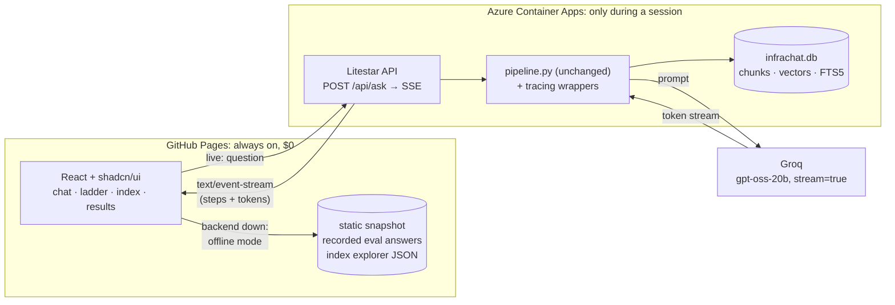
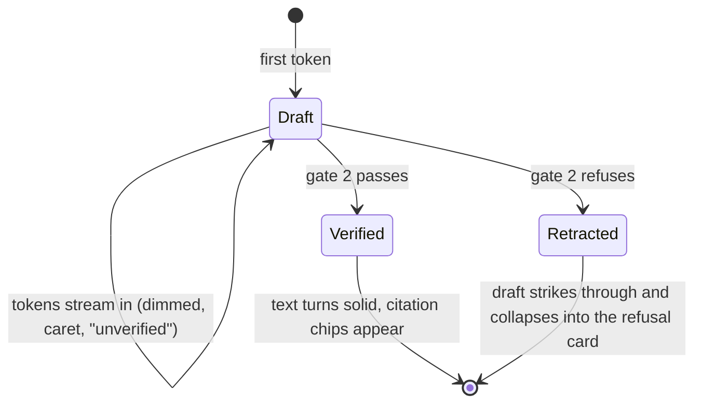
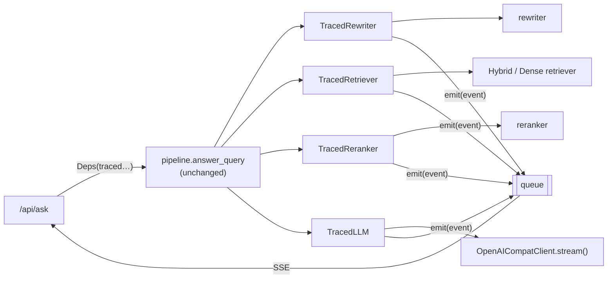
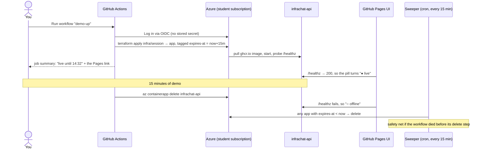
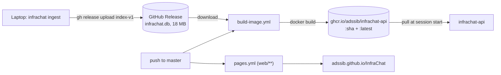

# Demo plan: a chat UI that shows its work, with a backend on a button

> **Status: built and deployed** (2026-10-03), except M10–M11 and M13. How to operate it: [DEPLOY.md](DEPLOY.md). Each milestone at the bottom is one step,
> shown and run before the next one starts (CLAUDE.md § Working agreement).

The shape in one sentence: **the UI is always up on GitHub Pages; the backend is provisioned
on Azure with one click and deletes itself after 15 minutes.**

1. **A chat UI** in the style of ChatGPT, Claude or Grok: a composer in the middle and answers that
   stream, plus what those don't show, **every step of the pipeline as it happens**.
   That covers what was retrieved, how each gate decided, and which lines of which doc page the
   answer rests on. A **ladder** mode sends one question through *no RAG → dense →
   +reranker → +hybrid* side by side: the eval, live.
2. **A disposable backend**: a Python API (Litestar) in Azure Container Apps that one click
   starts and that deletes itself after 15 minutes, at about $0.03 a session.

---

## 1. The idea in one picture



| Mode | When | What works |
|---|---|---|
| **Live** | A session is up (`/healthz` answers) | Anything you type, streamed, including the ladder |
| **Offline** | No session running | The example questions replayed from the recorded eval runs, the index explorer, the results charts, and a *"Start the backend"* link to the workflow button |

The site is never a dead link, which matters for a CV. Azure is the *live* half, not the whole
demo.

---

## 2. The UI

### Layout

```
┌──────────────────────────────────────────────────────────────────────────────┐
│ ◆ infrachat      Chat  Ladder  Index  Results          ● live · 12:41 left  │
├──────────────────────────────────────────────────────────────────────────────┤
│                                                                              │
│   How do I roll back a Deployment?                                     you   │
│                                                                              │
│   ▾ 2.1 s · 7 steps                                           ← the trace    │
│     ✓ embed           384-d                                  8 ms            │
│     ✓ dense           20 chunks                             31 ms            │
│     ✓ bm25            20 chunks · "rollout" "undo"           4 ms            │
│     ✓ fuse (rrf)      top 5 · 2 promoted by keyword ↑                        │
│     ✓ gate 1 floor    0.81 ━━━━━━━━━━━━━━━━┃━━━━  0.65                        │
│     ◌ generating      ▁▃▅▇  412 tok                                          │
│     ◌ gate 2 cites    checking…                                              │
│                                                                              │
│   Use `kubectl rollout undo deployment/<name>` to return to the previous    │
│   revision ▍                                       (draft, dimmed, unverified) │
│                                                                              │
│        ┌───────────────────────────────────────────────────────────┐         │
│        │ Ask the Kubernetes & Docker docs…                      ↑  │         │
│        └───────────────────────────────────────────────────────────┘         │
└──────────────────────────────────────────────────────────────────────────────┘
```

### What makes it more than a chat box

| Feature | What the visitor sees | Why it's there |
|---|---|---|
| **Live trace** | Each pipeline step appears as it runs, with its timing, like Claude's thinking block. It collapses to one line when the answer is verified | The project's argument is *how* it answers. Hiding that would make it look like any other chatbot |
| **Streamed draft → verified answer** | Tokens stream in dimmed with a caret. Gate 2 then either turns them solid and adds citation chips, or visibly **retracts** them into a refusal card (see below) | Real streaming, *and* gate 2 visibly doing its job |
| **Two-arm retrieval view** | Dense and BM25 lists side by side, with arrows for what fusion promoted ("↑ from keyword") | Makes ADR-0009/0011 visible: BM25 rescuing a literal like `BUILDKIT_INLINE_CACHE` |
| **Gate meters** | Gate 1 is a bar with the floor marked on it. Gate 2 is a tag-by-tag checklist: ✓ offered, ✗ invented | Refusals become understandable instead of mysterious |
| **Refusal cards** | *"Not in the docs"*, plus which gate fired and why ("best match 0.60 < floor 0.65", or "the model found nothing it could cite") | ADR-0001: **the refusal is a feature**. It should look deliberate, not like an error |
| **Citation chips** | `[1]` in the answer. Hover shows the chunk; click opens a side sheet with the chunk text and a **link to the exact lines on GitHub at the indexed commit** | Proves the answer isn't made up, down to the line. Run headers already record each corpus commit, and chunks already carry `L412–431` |
| **Ladder** (tab) | One question, four columns streaming at once: **No RAG · Dense · +Reranker · +Hybrid**. Each column shows its answer or refusal, its rank-1 chunk and its gate outcomes | The eval, live. On a trap question, *No RAG* answers confidently and the RAG columns refuse, which is the whole case for the project in one screen |
| **Index explorer** (tab) | The two corpora, their commits, 281 files as a tree. Click a page to see **exactly how it was chunked**: chunk boundaries, overlap highlighted, the tag the model would cite | "Shows the page it indexed": the offline half made visible, and the overlap fix (41% → 96.5%) as a picture |
| **Results** (tab) | The 8 eval charts and the headline table | "But does it work?" gets its measured answer one click away |
| **Session pill** | `● live · 12:41 left` or `○ offline · start backend ↗` | Honest about the 15-minute model |
| **Example questions** | Three groups of clickable starters (below), including traps | The most convincing moment is watching it refuse |

### Streaming the answer: draft, then verify

**Groq streams gpt-oss-20b** (`stream: true`, Groq reasoning docs, checked 2026-10-03), and
Litestar's SSE response works (spiked 2026-10-03). Since both are easy, the answer streams.

The catch: invariant 4 says *no answer renders without a citation*, and gate 2 can only
check citations once the whole answer exists. So streamed text is a **draft** until gate 2 says
otherwise:



- **Retraction is rare in practice and a good demo when it happens.** In the shipped
  `+hybrid` run, all 19 gate-2 refusals were the model writing `NOT_IN_DOCS`. That's one
  short token run, recognised and turned into a refusal card before it reads as an answer.
  When a model *does* write an uncited answer, the visitor watches gate 2 strike it out.
- **This changes invariant 4's wording**, from *"no answer renders without a citation"* to
  *"nothing is presented as a verified answer without a citation"*. That's a decision, so it
  gets **ADR-0012** before M6, and the CLAUDE.md invariant is updated to match.
- **Fallback:** if the M3 spike shows streaming misbehaving (for example, reasoning eating the
  stream), the UI switches to *hold, then reveal*: steps stream live, and the answer appears
  after gate 2. The event contract is the same either way.
- The model's **reasoning** goes into the trace as a collapsed *"scratchpad"* row. It streams
  (M3, below), and it arrives *before* the answer.

**M3 spike, 2026-10-03.** One call, the real grounded prompt for *"What is a Pod?"*, with
`stream: true` and `include_reasoning: true`:

| Measured | Result |
|---|---|
| Answer tokens | stream in `delta.content`: 61 pieces |
| Reasoning | **streams** in `delta.reasoning` (an extra field, passed through by the OpenAI SDK): 143 pieces, all *before* the first answer token |
| Timing | first reasoning token at 1.23 s, first answer token at 1.39 s, **done at 1.44 s** |
| Tokens | 1,063 total: 849 prompt + 214 completion, of which 144 were reasoning |
| Rate-limit headers | `x-ratelimit-limit-tokens: 8000` (per minute), `-remaining-tokens`, `-reset-tokens`, plus request limits. **The 200K/day cap is not in any header**; it only appears as an error |

What it means: (1) both streams are real, so `llm.reasoning` and `llm.token` stay in the
contract. (2) Groq is fast enough that the answer arrives as a **~0.2 s burst**, so most of the
"live" feel comes from the trace and the reasoning, not the answer text. (3) The draft shows raw
tags (`[kubernetes:workloads/pods/_index]`) that become `[1]` chips when gate 2 passes. That's a
visible "verified" moment. (4) The remaining-tokens header can drive a quiet "tokens left this
minute" readout; the daily cap has to be caught from the error.

### The ladder

| Rung | What runs | Gates |
|---|---|---|
| **No RAG** | The question straight to the LLM, with a plain system prompt and no excerpts | **None**, labelled *"ungrounded, for comparison"* |
| **Dense** | `pipeline.answer_query` with `hybrid: false, rerank: false` | both |
| **+Reranker** | `rerank: true` | both |
| **+Hybrid** *(shipped)* | `hybrid: true` | both |

- **Every rung except No RAG goes through the same `pipeline.answer_query`.** Only the `Deps`
  differ, and they're built once at startup and reused (ADR-0002's seams, used as intended). The
  No-RAG rung is a separate direct LLM call and **never goes through the pipeline**, so it
  can't weaken the gates.
- The four rungs run concurrently and stream into their own columns.
- **Rate limits:** four parallel generations is about 6K tokens at once. Groq's free tier allows
  8K tokens per minute, so on the free tier the ladder runs rungs one after another; on a paid
  tier, all at once. It's one setting (`ladder.parallel`).
- The image must also include the cross-encoder model (pre-warmed like the embedder) so the
  reranker rung starts instantly.

### Example questions

**Every example comes from the eval set and was answered correctly, or correctly refused, in
the shipped `+hybrid` run**, so the first click always works. In offline mode these replay the
recorded answers; in live mode they run for real.

| Group | Questions | What it shows off |
|---|---|---|
| **Kubernetes** | *What is a Pod?* · *What does CrashLoopBackOff mean?* · *When a node runs out of memory, which pod gets killed first?* · *How do I stop two copies of the same app from being placed on one node?* | Basics, an exact term, and two paraphrases that never name the feature |
| **Docker** | *What is a multi-stage build?* · *How do I pass a secret to a build without baking it into the image?* · *How do I set BUILDKIT_INLINE_CACHE=1?* · *How do I stop pip install from running again every time I change my source code?* | Basics, the literal that BM25 rescues, and a paraphrase of cache mounts |
| **Try to trick it** | *How do I bake sourdough bread?* · *How do I set up a GitLab CI pipeline to build and push my image?* · *How do I write a docker-compose.yml to run my web app and database together?* | Gate 1 (sourdough 0.60 < 0.65), gate 2 (GitLab CI clears the floor at 0.77, but the model finds nothing to cite), and a near-miss (Compose isn't in the corpus). **Best in the Ladder tab**, where No RAG answers them confidently |

The list lives in `web/src/examples.json`. If the eval set or the corpus changes, re-check that
each one still behaves as labelled.

### Look: shadcn/ui, Grok's palette, Geist

| Piece | Choice |
|---|---|
| Components | **shadcn/ui** (Vite install): `Button`, `Textarea`, `Card`, `Badge`, `Tabs`, `Sheet` (citation drawer), `Collapsible` (trace), `Tooltip`, `ScrollArea`, `Skeleton`, `Sonner` (toasts) |
| Icons | **lucide-react**, the shadcn default: `ArrowUp` send, `Check` passed, `Ban` refused, `TriangleAlert` error, `FileText` doc, `ExternalLink`, `ChevronDown` trace, `Timer` session, `Layers` ladder, `Database` index |
| UI font | **Geist** (variable), for text, labels and buttons |
| Data font | **Geist Mono**, for everything technical: scores, timings, tags, the trace, code and the wordmark. Mono for numbers is what makes it look like a tool |
| Font loading | `@fontsource-variable/geist` + `@fontsource-variable/geist-mono` (v5.3.0 on npm), **self-hosted** in the build, so there are no Google Fonts requests from Pages |
| Optional niche accent | **Departure Mono** (free, OFL), only for the `◆ infrachat` wordmark, if Geist Mono reads too plain there |

**Colours: Grok's palette**, read from grok.com's own stylesheet (2026-10-03), mapped onto
shadcn's CSS variables. Grok is almost entirely monochrome: near-black surfaces, a grey scale,
borders as white at low opacity, and one blue accent. **Dark is the default.** The dark column uses Grok's *warm body* palette (`hsl(30 5% 7%)` / `12%`), lifted a step: the pure `#050505` surface read as pitch black and was dropped (2026-10-03). Only the palette
is borrowed: no logo, name or layout.

| shadcn variable | Grok token | Dark (default) | Light |
|---|---|---|---|
| `--background` | surface-base | `#161514` | `#fcfcfc` |
| `--card`, `--popover` | surface-l1 | `#1f1e1c` | `#f7f7f7` |
| `--muted`, `--secondary` | surface-l2 | `#272623` | `#f2f2f2` |
| `--accent` (hover) | surface-l3 | `#33312d` | `#e8e8e8` |
| `--foreground` | fg-primary | `#f4f3f1` | `#050505` |
| `--muted-foreground` | fg-secondary | `#a3a19c` | `#636363` |
| placeholder | fg-tertiary | `#858585` | `#858585` |
| `--border`, `--input` | border-l1 / l2 | white 8% / 14% | black 6% / 10% |
| `--ring` | border-l3 | white 20% | black 15% |
| `--primary` | fg-accent | `#299fff` | `#0890ff` |

Plus three status colours that Grok doesn't define, **always with an icon and a label**:

| Status | Colour | Where |
|---|---|---|
| ✓ passed | green `#1baf7a` | passed gate rows, verified citations |
| ⦸ refused | amber `#eda100` | refusal cards and failed gates. **Amber, not red**: a refusal is the system working (ADR-0001) |
| ⚠ error | red `#e34948` | rate limit, daily cap, server errors |

Source badges (Kubernetes / Docker) stay monochrome outline badges, with no brand colours
competing with the status colours.

### Frontend stack

| Piece | Choice | Why |
|---|---|---|
| Build | **Vite + React + TypeScript** | Static output, which is what GitHub Pages serves |
| Styling | Tailwind v4 + shadcn/ui | shadcn's components are copied into the repo and themed by the variables above |
| Streaming | `fetch` + a small `ReadableStream` SSE parser | `EventSource` can't send a POST body |
| Markdown | `react-markdown` + `rehype-highlight` | Answers contain `kubectl` and Dockerfile snippets |
| State | one reducer per message (per column in the ladder), driven by events | Each SSE event is one reducer action, so the trace renders itself |
| Hosting | **GitHub Pages**, deployed by `pages.yml` on push to `master` (path filter `web/**`) | Always on, $0 |
| Backend URL | `VITE_API_URL`, baked in at build time | It's stable, because the Container Apps environment is permanent (§ 3) |

The code lives in `web/`. The Python image no longer serves a UI, and Gradio is retired once
the React app matches it, which also makes the image smaller.

---

## 3. The backend

### Why Litestar

| Option | Verdict |
|---|---|
| **Litestar** | **Chosen.** Built-in SSE response, CORS config and rate-limit middleware, all three spiked on Litestar 2.24 (2026-10-03). Typed, async, with the same ASGI and uvicorn stack the project already ships |
| FastAPI | Works, but the owner doesn't want it |
| Flask | Synchronous, which suits the synchronous pipeline, but SSE, CORS and rate limiting become three add-ons |
| Spring Boot | Would mean either a second implementation of the gates (and eval numbers that no longer describe the deployed code) or a Java gateway in front of Python. Not now |

### Events: the contract

`POST /api/ask {"question": "...", "rung": "hybrid"}` returns `text/event-stream`. Ladder
requests send one request per rung. In order:

| `event:` | `data` (JSON) | Emitted by |
|---|---|---|
| `start` | `{id, question, rung, config: {hybrid, rerank, rewrite, floor}}` | API |
| `rewrite` | `{query, changed}` | rewriter wrapper |
| `embed` | `{dims, ms}` | retriever wrapper |
| `retrieve.dense` | `{hits: [{tag, doc, lines, score, rank}], ms}` | retriever wrapper |
| `retrieve.keyword` | `{hits: [{tag, rank, terms}], ms}` | retriever wrapper (hybrid only) |
| `fuse` | `{hits: [{tag, fused_rank, dense_rank, keyword_rank, score}]}` | retriever wrapper |
| `rerank` | `{moves: [{tag, from, to}], ms}` | reranker wrapper |
| `gate.floor` | `{passed, top_score, floor, margin}` | from `Retrieval.decision` |
| `prompt` | `{excerpts, tokens_est}` | LLM wrapper |
| `llm.reasoning` | `{delta}` (repeated) | LLM wrapper, from `delta.reasoning` (confirmed in M3) |
| `llm.token` | `{delta}` (repeated) | LLM wrapper, **rendered as a draft** |
| `gate.citations` | `{passed, cited: [tag], invented: [tag], said_not_in_docs}` | from the `Answer` |
| `answer` | `{text, citations: [{n, tag, doc, lines, github_url, chunk_text}]}` | after gate 2 passes, **the draft becomes this** |
| `refusal` | `{gate: "floor" \| "citation", reason}` | instead of `answer`, **the draft is retracted** |
| `done` | `{ms_total, tokens: {prompt, completion, reasoning}, ratelimit: {remaining_tokens, reset_s}}` | API, from the usage block and the `x-ratelimit-*` headers |
| `error` | `{kind: "rate_limit" \| "daily_cap" \| "internal", message}` | API |

### Tracing without touching `pipeline.py`

The pipeline is *the seams composed and nothing else*, and it never changes (invariant 2). The
trace comes from the seams: **each dependency is wrapped in a tracing decorator** that runs the
real component and emits an event.



- The pipeline runs in a worker thread and pushes events onto a queue that the SSE response
  drains. It stays synchronous, exactly as the eval harness uses it.
- `TracedLLM.complete()` calls a new `OpenAICompatClient.stream()`, which emits `llm.token`
  as tokens arrive and **returns the full completion**, so `citations.verify` sees exactly what
  it sees today. The eval keeps using `complete()`.
- The two hybrid arms are inside `HybridRetriever.retrieve()`. For the dense/BM25 panel, the
  wrapper reads an optional `last_arms` attribute the retriever sets. It's display-only and
  never feeds a decision.
- Gate events are read from `Retrieval.decision` and the `Answer` **after** the pipeline
  produced them. The UI reports the gates; it never re-implements them.

### Endpoints

| Endpoint | Returns |
|---|---|
| `POST /api/ask` | the SSE stream above (`rung`: `norag` \| `dense` \| `rerank` \| `hybrid`) |
| `GET /api/meta` | `{expires_at, config, commit, corpus_commits}`, for the session pill and the footer |
| `GET /healthz` | 200 once the index, embedder and reranker are loaded, for the deploy probe and the UI's live/offline check |

The index explorer and the results tab are **static** (exported to `web/public/` at build time),
so they work offline and the API stays small.

**Guardrails:** CORS allows only `https://adssib.github.io`; questions are capped at 500
characters; Litestar's rate limiter allows about 10 asks per minute per IP; there's a friendly card
when Groq's daily cap is hit. The Groq key stays server-side.

---

## 4. Deployment

### Two layers: a permanent environment and a per-session app

A static site has to know the API's address, and a **new** Container Apps environment gets a
new random hostname every time. So:

| Layer | Lifetime | Contents | Cost when idle |
|---|---|---|---|
| **core** (`infra/core`) | Permanent, applied once by hand | resource group `rg-infrachat`, the Container Apps **environment** (Consumption, logs off) | **$0**: the environment fee only applies to the Dedicated plan. Confirm in Cost Management |
| **session** (`infra/session`) | 15 minutes | the **container app** `infrachat-api`, tagged `expires-at` | gone |

The app's address is `infrachat-api.<environment's default domain>`, which stays **the same for
every session** because the environment and the app name never change. It goes into
`VITE_API_URL` once. As a bonus, sessions start faster, since the slow part (creating an
environment) happened once.

### Cost (Azure Retail Prices API, East US, checked 2026-10-03)

| Item | Price | Per 15-min session (1 vCPU, 2 GiB) |
|---|---|---|
| vCPU (active) | $0.000024 / vCPU-second | 900 s → $0.022 |
| Memory (active) | $0.000003 / GiB-second | 1,800 GiB-s → $0.005 |
| Environment | $0 on Consumption | $0 |
| Image | GitHub Container Registry, public | $0 |
| Frontend | GitHub Pages | $0 |
| LLM | Groq: free tier now, paid tier possible later (calls already planned at full rate) | $0 now |
| **Total (Azure)** | | **≈ $0.027** |

**Free grant:** 180,000 vCPU-s and 360,000 GiB-s per subscription per month, so **about 200
sessions a month cost $0**, and the $100 credit covers about 3,700 more after that.

### The button



| Piece | How |
|---|---|
| **Trigger** | `workflow_dispatch` on `demo-up.yml`: the "Run workflow" button on GitHub (also in the phone app). The offline pill links straight to it |
| **Auth** | OIDC federated credential on an app registration, with a role scoped to **`rg-infrachat` only**, not the subscription. No client secret exists to leak |
| **Infra as code** | **Terraform**, `azurerm` provider. `infra/core` is applied once from the laptop (its state file stays local and gitignored). `infra/session` is applied by the workflow with throwaway state. **Teardown is `az containerapp delete`, not `terraform destroy`**, so the session state never needs storing |
| **Teardown** | The workflow waits 15 minutes, then deletes the app. **Plus** `demo-sweep.yml` on a cron deletes any app whose `expires-at` has passed |
| **One session at a time** | `concurrency: infrachat-demo`. A second click queues instead of doubling the cost |
| **Groq key** | GitHub secret → `TF_VAR_groq_api_key` (`sensitive`) → Container App secret → env var. It's never in the image, the logs or the repo |
| **Expiry** | `EXPIRES_AT` env var → `/api/meta` → the session pill's countdown |
| **Budget** | An Azure budget alert at $5, created once by hand |
| **Wrong-subscription guard** | The `azurerm` provider pins `subscription_id = 2b812a74-…`, and every `az` call passes `--subscription`. The Concordia production subscription is never targeted |

### The image: built in CI, the index shipped as a Release asset



- `data/infrachat.db` is a **build artifact**, so it lives on a Release (`index-v1`, then
  `index-v2` when the corpus changes), not in git.
- The image pre-warms both the embedder and the cross-encoder, so `/healthz` goes green quickly.
- Docker isn't reachable from WSL right now, and building the image in CI means it doesn't need
  to be.

---

## 5. Milestones: one step each

| # | Step | Done when |
|---|---|---|
| ~~M1~~ | ✅ **Spike the deploy by hand.** `infra/core` (environment) + a minimal app from the existing image, applied from the laptop, timed to the first HTTP 200, then the app deleted | We know the startup time, and that an idle environment really costs $0 |
| ~~M2~~ | ✅ Release `index-v1` + `build-image.yml` → `ghcr.io/adssib/infrachat-api` | The image pulls publicly and `ask --retrieval-only` works in it |
| ~~M3~~ | ✅ **Spike Groq streaming** (2026-10-03) | Both stream; reasoning first. See § 2 *Streaming the answer* |
| ~~M4~~ | ✅ `OpenAICompatClient.stream()` + tracing wrappers (`infrachat/trace.py`) + `ask --trace` | Verified on an answer, a gate-1 refusal and a gate-2 refusal; `pipeline.py` untouched |
| ~~M5~~ | ✅ **ADR-0012**: streamed drafts and invariant 4's new wording | On record |
| ~~M6~~ | ✅ Litestar app (`infrachat/api.py`): `/api/ask` (SSE), `/api/meta`, `/healthz`, CORS, rate limit | `curl -N` showed steps at 0.1 s, reasoning at 1.6 s, tokens at 2.6 s, verdict at 2.7 s |
| ~~M7~~ | ✅ `web/`: Vite + shadcn + theme + fonts; composer, trace, draft → verified/retracted, refusal card, examples; replays offline, live when `/healthz` answers | **The "usable" line** |
| ~~M8~~ | ✅ Citation chips link straight to the page on GitHub at the indexed commit (pages, not lines: ROADMAP § Open) | Clicking `[1]` opens the cited page |
| ~~M9~~ | ✅ `CD_pages.yml` + live/offline detection + session pill | The site is up on Pages, and says "offline" with no backend running |
| M10 | Ladder: the No-RAG rung, the per-rung `Deps`, four columns | One trap question shows No RAG answering and the RAG rungs refusing |
| M11 | Offline snapshot: recorded eval answers + index explorer export + results tab | Offline mode replays examples and browses chunks |
| ~~M12~~ | ✅ `CD_demo_up.yml` + `CD_demo_sweep.yml` (Terraform, OIDC via a managed identity) + budget alert | One click → live in the Pages UI → offline again 15 minutes later, with the sweeper proven by killing a run mid-way |
| M13 | README: "Try it", the Pages link, and a GIF of a session | A reviewer sees it working without starting anything |

---

## 6. Open questions

- **Idle environment cost** (M1). The Consumption environment should cost $0 with no app
  running; confirm in Cost Management. If it doesn't, fall back to a per-session environment
  and publish the new URL to Pages on each session.
- **Free grant on Azure for Students.** It should apply per subscription; confirm after the
  first session.
- **No-RAG in offline mode.** There's no recorded No-RAG eval run yet. One run of the 87
  questions without retrieval would let the ladder replay offline too.
