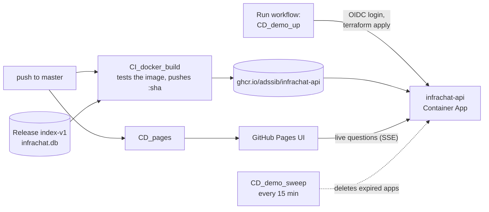

# Deploying InfraChat

Three pieces, each shipped its own way:

| Piece | Where it runs | How it gets there | Cost |
|---|---|---|---|
| **Web UI** (`web/`) | GitHub Pages, [adssib.github.io/InfraChat](https://adssib.github.io/InfraChat/), always on | `CD_pages` on every push to `web/**` | free |
| **API** (`infrachat serve`) | Azure Container Apps, **only during a session** | `CD_demo_up`: the "Run workflow" button | ~$0.03 per 15-minute session |
| **Index** (`infrachat.db`) | inside the API image | GitHub Release `index-v1`, baked in by `CI_docker_build` | free |

With no session running, the UI plays recorded runs of its example questions. While a
session is up, the same page answers live: it checks `/healthz` on load and its pill turns
**Live**. The plan and the reasoning behind every choice here: [DEMO-PLAN.md](DEMO-PLAN.md).



---

## Start a live session

**GitHub → Actions → CD_demo_up → Run workflow** (15 or 30 minutes).

The run logs in to Azure, picks the newest image that passed CI, applies `infra/session`,
waits until `/healthz` answers (about 40 s), writes the "live until" time to its summary, then
sleeps and deletes the app, whether the run succeeds, fails or is cancelled. One session at a
time: a second click waits for the first.

Only someone with write access to the repository can press it. That protects the budget: a
visitor can read the recorded answers and the report, but can't start the meter.

**Measured 2026-10-03:** click to healthy in about a minute (including the runner and
`terraform init`); a live question answers in about 3.3 s, with the trace and reasoning
streaming through Azure's ingress unbuffered; teardown confirmed by the run.

### What stops a session

| Layer | What it does |
|---|---|
| `CD_demo_up`'s last step | Deletes the app at the expiry, on success, failure and cancellation (`if: always()`) |
| `CD_demo_sweep` | Every 15 minutes, deletes any app whose `expires-at` tag has passed, or that has none |
| Budget `infrachat-monthly` | Emails the subscription owners at $2.50 and $5 actual, and $5 forecast |

If a session was started by hand (`terraform apply` from a laptop), the sweeper still catches
it at its `expires-at`. To stop one immediately:

```bash
az containerapp delete -n infrachat-api -g rg-infrachat \
  --subscription 2b812a74-f9f4-4848-b71d-eb7898148ce3 --yes
```

---

## Azure, once: `infra/core`

Applied from a laptop, once. Its state stays local and gitignored.

```bash
az login                                   # then check: az account show → Azure for Students
terraform -chdir=infra/core init
terraform -chdir=infra/core plan           # read it: only + lines, no - or -/+
terraform -chdir=infra/core apply
```

| Resource | Why |
|---|---|
| `rg-infrachat` (canadacentral) | everything lives here; one group to scope access and spend |
| `cae-infrachat`, Consumption | the Container Apps environment. It fixes the API's hostname, `infrachat-api.<default_domain>`, which the Pages build hard-codes. $0 with no app running |
| `id-infrachat-github` + federated credential | lets **only** this repo's `master` workflows log in, with no stored password |
| Contributor on `rg-infrachat` | the identity can't touch anything outside the group |
| budget `infrachat-monthly` | the alert above |

Things this subscription taught us, each now encoded in the Terraform:

- **Azure for Students allows five regions**: francecentral, northcentralus, norwayeast,
  westus, canadacentral. `eastus` fails with `RequestDisallowedByAzure`.
- **`Microsoft.ManagedIdentity` had to be registered** on the subscription before the identity
  could be created (`az provider register -n Microsoft.ManagedIdentity`).
- **GitHub's OIDC subject names the owner and repo by id**:
  `repo:adssib@75389300/InfraChat@1351873446:ref:refs/heads/master`. A subject without the ids
  is rejected (`AADSTS700213`).
- **Azure adds a `Consumption` workload profile** to a new environment; it's declared so
  Terraform doesn't plan to remove it.

The workflows read three **repository variables** (not secrets; they identify, they don't
authenticate): `AZURE_CLIENT_ID` (the identity), `AZURE_TENANT_ID`, `AZURE_SUBSCRIPTION_ID`.
The one **secret** is `INFRACHAT_LLM_API_KEY`: GitHub secret → `TF_VAR_llm_api_key` → Container
App secret → env var. It's never in the image, the repo, a file or a log.

---

## The image

`CI_docker_build` on every push that touches the code:

1. downloads `infrachat.db` from Release `index-v1` and checks its pinned sha256,
2. builds the image (the embedding model is pre-warmed into it),
3. **smoke-tests it with `--network none`**: no network, no volume, no key, and it must still
   retrieve the Pods page for "what is a Pod?",
4. checks it doesn't run as root,
5. on `master`, pushes `ghcr.io/adssib/infrachat-api:<sha>` and `:latest` (public).

**Changing the corpus** means: re-ingest locally, `gh release create index-v2 data/infrachat.db`,
and bump `INDEX_VERSION` and `INDEX_SHA256` in `CI_docker_build.yml`. That commit is the record
that the index changed, and a new index invalidates comparison with earlier eval runs.

**Size: 457 MB** (CI, 2026-10-03), down from 630 MB when Gradio and its 26 dependencies were
removed. No torch: `fastembed` runs the model through onnxruntime (ADR-0005).

Notes before changing the Dockerfile:

- **`-slim`, not `-alpine`.** onnxruntime publishes manylinux wheels only. The builder installs
  with `--only-binary=:all:`, so a dependency that wants to compile stops the build instead.
- **Loadable SQLite extensions work in `python:3.12-slim`** (sqlite-vec needs them).
- **The embedder name is read from `config.yaml` at build time**, never repeated, because it's
  held fixed across phases.
- **`ENTRYPOINT` is `python -m infrachat` and `CMD` is `serve`**, so the container runs the API
  on :8000 by default and any subcommand otherwise: `docker run <image> ask --retrieval-only "…"`.
- **`/app/data` stays writable** even though the index is read-only in practice: the store opens
  SQLite in WAL mode, which writes `-wal`/`-shm` files beside it.

---

## Local

```bash
# Python side
python -m infrachat serve -c config.yaml        # API on :8000 (key from INFRACHAT_LLM_API_KEY)
python -m infrachat ask --trace "what is a Pod?"   # the same events, in the terminal

# Web side (Node 22: web/.nvmrc)
cd web && npm install && npm run dev            # http://localhost:5173/InfraChat/
```

The dev UI talks to `http://localhost:8000` (set `VITE_API_URL` to point elsewhere) and falls
back to recorded runs when nothing answers there. The API's CORS allows the Pages site and
`localhost:5173`; the deployed session allows only the Pages site.

With Docker instead (`docker compose`): `ingest`, `ask` and `eval` run against `./data`,
`./corpus` and `./eval` mounted from the host, and `docker compose up infrachat` serves the API
on :8000. The key comes from a gitignored `.env`, injected by compose, never baked in.
